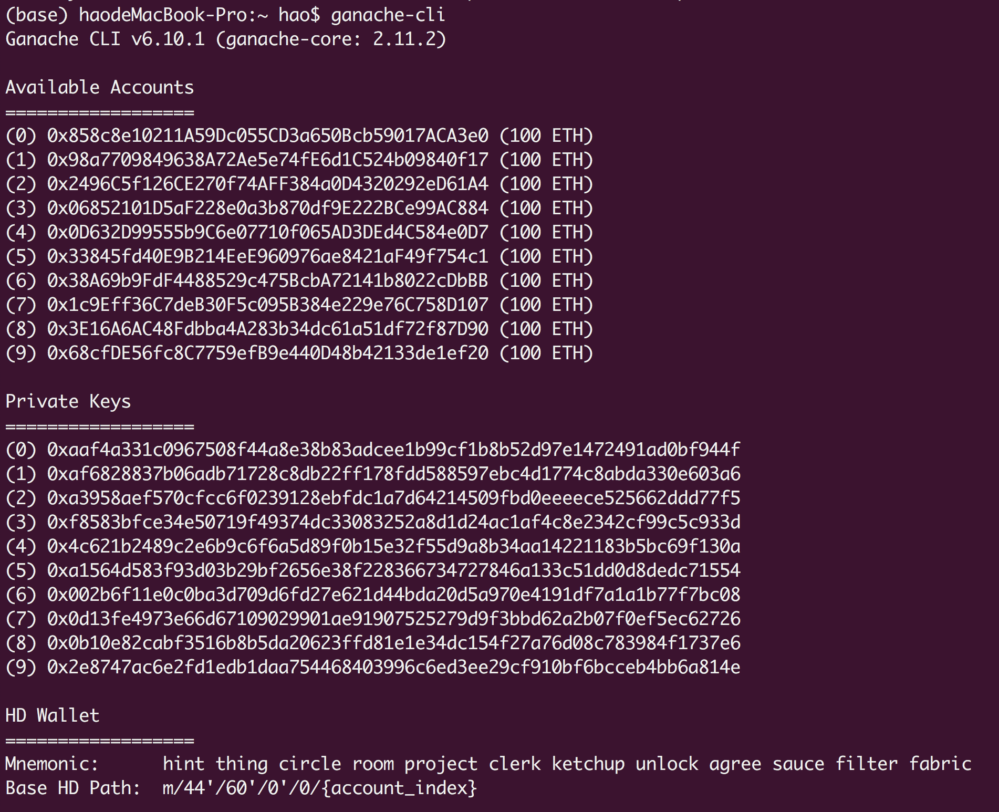

# eth-wallet-cli

这是一个简易的以太坊钱包命令行工具，主要支持功能如下:

1. 账户管理:
    * 生成新账户
    * 助记词导入
    * 私钥导入
    * 显示所有账户

2. ERC20 Token:
    * 部署新的ERC20 Token合约
    * 获取账户合约余额
    * 获取ERC20 Token发行总量
    * 交易ERC20 Token
    
3. ether:
    * 获取余额
    * 交易eth
    
4. 交易:
    * 获取交易信息
    * 获取交易结果信息
    * 发送交易
    
## 测试运行

请保证电脑上安装有python3(>=3.5)、pip3。

- 本地测试: 请安装[Ganache-cli](https://github.com/trufflesuite/ganache-cli).
- 以太坊测试链: 请保证你的钱包中至少一个1个以上的eth（测试币），并有可以使用的rpc地址。(建议使用infura)

安装ganache-cli:
```bash
npm install -g ganache-cli
```

运行测试链:
```bash
ganache-cli
```

安装依赖包:
```bash
cd $代码目录
pip3 install web3 click eth-account
```

运行命令:
```bash
python cmd.py --help
```

请注意: **在发送交易时，需要发送方有一定的ether用于支付手续费。这里可以使用以太坊测试链生成的账户(Private Keys)，并使用--priv参数传递即可**:


    
## 命令列表

`python cmd.py`支持的命令列表，**给出的例子中省略了部分可选参数，具体参数列表可以运行命令帮助获取**

- [`account`](#account)
    - [`add`](#account-new)
    - [`load`](#account-load)
    - [`recover`](#account-recover)
    - [`show`](#account-show)
- [`erc20`](#erc20)
    - [`deploy`](#erc20-deploy)
    - [`get-balance`](#erc20-get-balance)
    - [`total-supply`](#erc20-total-supply)
    - [`transfer`](#erc20-transfer)
- [`ether`](#ether)
    - [`get-balance`](#ether-get-balance)
    - [`transfer`](#ether-transfer)
- [`tx`](#tx)
    - [`get`](#tx-get)
    - [`receipt`](#tx-receipt)
    - [`send`](#tx-send)

### `account`

管理账户

#### `account new`

创建一个新的以太坊账户，会自动生成助记词，同时使用提供的密码加密

例子:
```bash
python cmd.py new --pw 123 --ks ./keystore
```

#### `account load`

通过私钥导入以太坊账户，同时使用提供的密码加密

例子:
```bash
python cmd.py load --ks ./keystore --priv 0x18d7d5a31482980499c875484ded49adb0e48fc558eb0e2253b6e2a7e320cef1 --pw 123 
```

#### `account recover`

通过助记词恢复以太坊账户，同时使用提供的密码加密

例子:
```bash
python cmd.py recover --ks ./keystore --mnemonic "such biology dinosaur end reduce trade gossip random swamp govern brass wealth" --pw 123
```

#### `account show`

显示当前keystore下所有的账户信息

例子:
```bash
python cmd.py show --ks ./keystore
```

### `erc20`

与以太坊erc20 token合约交互，交易token，查询余额等

#### `erc20 deploy`

部署新的的erc20 合约

例子:
```bash
python cmd.py erc20 deploy --priv 0x18d7d5a31482980499c875484ded49adb0e48fc558eb0e2253b6e2a7e320cef1 --name "USDT Token" --symbol USDT
```

#### `erc20 get-balance`

获取地址的token余额

例子:
```bash
python cmd.py erc20 get-balance --token 0x53C98101F6756325098Fcc8BFe1A346b7038bA8d --account 0x8fA350c982a3aD264Dd58F2d40E9167b135033d7 
```

#### `erc20 total-supply`

查询erc20 token发行总量

例子:
```bash
python cmd.py erc20 total-supply --token 0x53C98101F6756325098Fcc8BFe1A346b7038bA8d
```

#### `erc20 transfer`

交易erc20 token

例子:
```bash
python cmd.py erc20 transfer --priv 0x18d7d5a31482980499c875484ded49adb0e48fc558eb0e2253b6e2a7e320cef1 --to 0x53C98101F6756325098Fcc8BFe1A346b7038bA8d --token 0x150C073B408d073FD26b5207eE3EB3dB93B8Ff58 --amount 1
```

### `ether`

交易以太坊ether，查询ether余额

#### `ether get-balance`

查询以太坊ether余额

例子:
```bash
python cmd.py ether --account 0x53C98101F6756325098Fcc8BFe1A346b7038bA8d
```

#### `ether transfer`

交易以太坊ether

例子:
```bash
python cmd.py --priv 0x18d7d5a31482980499c875484ded49adb0e48fc558eb0e2253b6e2a7e320cef1 --to 0x53C98101F6756325098Fcc8BFe1A346b7038bA8d --amount 1
```

### `tx`

查询、发送以太坊交易

#### `tx get`

查询以太坊交易信息

例子:
```bash
python cmd.py tx get --tx 0xb269ce1a3a37d8f1ba8f46fbe5a8361dfbe0711a52e29355e224eb01bdae0bf4
```

#### `tx receipt`

查询以太坊交易收据信息，是否成功等

例子:
```bash
python cmd.py tx receipt --tx 0xb269ce1a3a37d8f1ba8f46fbe5a8361dfbe0711a52e29355e224eb01bdae0bf4
```

#### `tx send`

发送以太坊交易

例子:
```bash
python cmd.py tx send --priv 0x18d7d5a31482980499c875484ded49adb0e48fc558eb0e2253b6e2a7e320cef1 --to 0x53C98101F6756325098Fcc8BFe1A346b7038bA8d --amount 1 --gas 21000 --gas_price 20000000000
```

